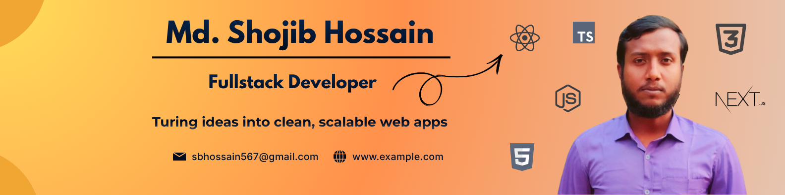

# Hi, I'm Shojib Hossain 👋

### Full-Stack Web Developer | Laravel | React | Next.js

  

  
  
  
  

## 👨‍💻 About Me

I'm a passionate web developer focused on building modern, responsive, and user-friendly web applications.

- 🚀 Currently exploring **Next.js, React, and modern full-stack development**
- 🔧 Building projects with **Laravel, React, Next.js, Node.js, and MongoDB**
- 🎨 Interested in creating clean and responsive UI with **Tailwind CSS**
- 📚 Continuously learning new technologies and improving my development skills
- 💡 I enjoy turning ideas into practical web applications

## 🔭 What I'm Currently Working On

- 🌐 Exploring **Next.js** and advanced React concepts
- 🛒 Building and improving **full-stack web applications**
- ⚙️ Working with **Laravel REST APIs and authentication**
- 🧩 Developing reusable UI components with **React + Tailwind CSS**
- 📖 Learning more about **backend architecture, APIs, databases, and deployment**

---

## 🛠️ Skills & Technologies

<table width="100%"> <tr> <th align="center">Category</th> <th align="center">Technologies</th> </tr>

<tr> <td align="center"><b>Frontend</b></td> <td align="center">  </td> </tr>

<tr> <td align="center"><b>Backend</b></td> <td align="center">  </td> </tr>

<tr> <td align="center"><b>Database</b></td> <td align="center">  </td> </tr>

<tr> <td align="center"><b>Deployment Platform</b></td> <td align="center">  </td> </tr>

<tr> <td align="center"><b>Design & Graphics</b></td> <td align="center">  </td> </tr>

<tr> <td align="center"><b>Tools</b></td> <td align="center">  </td> </tr> </table>

---------

## 🌐 Connect With Me

  
  
  
  

---

## 📊 GitHub Statistics

  
  

  

---

## 📌 Featured Projects

### 🚀 Project 1 — FitLog-Workout Library Management Application

**Short description:**  
A modern and responsive Workout Library web application built with Next.js and TypeScript. Users can explore different workouts, view detailed workout information, add exercises to Today's Plan, and save workouts for later. The application uses Context API and LocalStorage to maintain workout selections even after refreshing the page.

**Tech Stack:**  
`Next.js` `React` `Tailwind CSS` `Node.js` `MongoDB`

**Key Features:**
- 🔐 Authentication and authorization
- 📱 Responsive design
- 🔎 Sorting and filtering
- ⚡ Fast and interactive user interface
- 🗃️ LocalStorage integration

**Links:**
- 🌐 Live Demo: [View Project](https://fitlog-next-app.vercel.app/)
- 💻 Repository: [GitHub](https://github.com/sojibkhan567/fitlog-next-app)

---

### 🚀 Project 2 — Dotorly - A Hospital Management Application

**Short description:**  
This a php based web application that developed by the Laravel framework. This application is used for management of doctors, patients, appoinment etc.

**Tech Stack:**  
`Laravel` `PHP` `MySQL` `Blade` `Tailwind CSS`

**Key Features:**
- 🔐 User authentication
- 👥 Role-based functionality
- 📝 CRUD operations
- 📤 File/media management
- 🔌 REST API integration

**Links:**
- 🌐 Live Demo: [View Project](YOUR_LIVE_PROJECT_URL)
- 💻 Repository: [GitHub](YOUR_REPOSITORY_URL)

---

## 🎯 2026 Goals

- [ ] Improve advanced **Next.js** skills
- [ ] Build more production-ready full-stack applications
- [ ] Improve backend architecture and API design
- [ ] Learn more about cloud deployment and DevOps
- [ ] Contribute to open-source projects
- [ ] Build and maintain a strong GitHub portfolio

---

## 💡 Development Philosophy

> **Learn → Build → Break → Debug → Improve → Repeat**

I believe the best way to learn development is by building real projects, solving problems, and continuously improving.

---

  Thanks for visiting my profile! ⭐

  <i>Let's build something great together.</i> 🚀

